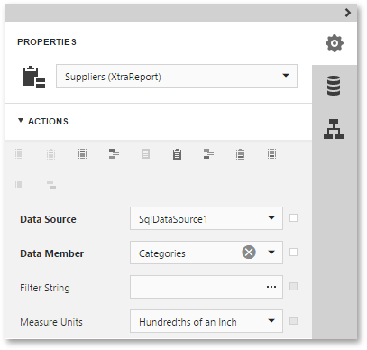

This page is displayed if two or more tables and/or views are selected on a previous wizard page: [Create a Query or Select a Stored Procedure](../../../../../../interface-elements-for-web/articles/report-designer/wizards/sql-data-source-wizard/adding-a-new-data-source/create-a-query-or-select-a-stored-procedure.md).

On this page, you can define master-detail relationships between two or more queries by specifying their corresponding key fields.

On clicking **Finish**, the new data source will be added to the report and displayed in the [Field List](../../../../../../interface-elements-for-web/articles/report-designer/interface-elements/field-list.md).

To use the created data source in a report, assign this data source to the report's **Data Source** property and set the **Data Member** property to a required query name.

