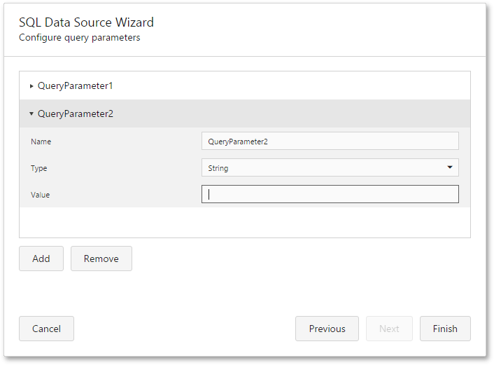

# Configure Query Parameters
This page is displayed if any query parameters were created on the [previous wizard page](create-a-query-or-select-a-stored-procedure.md).

On this page, you can manage query or stored procedure parameters and specify their values.

To add a new query parameter or remove an existing one, use the **Add** and **Remove** buttons.

You can customize the name, type and value of an existing parameter.

When the parameter type is set to **Expression**, the value editor displays the ellipsis button, and clicking on it invokes the [Expression Editor](../../../interface-elements/expression-editor.md).

To link a query parameter to an existing report parameter, type the report parameter name using the following syntax: **[parameters.parameter1]**.

Clicking **Finish** will close the wizard and apply the changes to the data source.