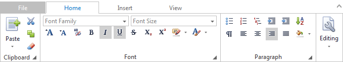

# Ribbon
The Ribbon provides a rich toolbar functionality.

If a ribbon contains several tabs, click a tab header to switch to the tab and display its items. However, the **File** tab does not contain items. Click it to display the **File** menu.

Click the ribbon items to perform specific item actions. You can see an item action hint by hovering the item.

Ribbon items are categorized by groups. You can view the group name under the items. When the ribbon has insufficient space to display all of its items, a group can automatically be collapsed. Click the group's button to display the content of the group.

Ribbon groups can display a dialog box launcher, which is an arrow icon located in the bottom right corner of a group. Click the launcher to display a dialog box related to the group.

If an item displays a drop-down button (an arrow), click it to display the item's drop-down menu.

