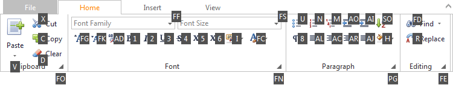

To select a specific command, you can click it with the mouse or invoke it via its access key. See below for more information.

Access keys are associated with each tab and command in the Ribbon. Access keys can be visualized using KeyTips. The KeyTips are little boxes displaying access keys. To see the KeyTips, press Ctrl+Shift+[Access Key] (Access Key is defined by your application vendor). KeyTips will appear next to the corresponding tabs and commands.

Access keys can be composed of one, two or three symbols. 
If an access key is represented by one symbol, you can invoke the command by pressing the symbol shown in the KeyTip. 
If an access key is represented by two or three symbols, to invoke the command, press the symbols shown in the KeyTip one after another.

Initially, when pressing Ctrl+Shift+[Access Key], KeyTips are displayed for tabs.
To invoke KeyTips for commands within a specific tab, you need to press the access key associated with this tab.
To move from a specific tab back to displaying KeyTips for all tabs press Esc.

For example, to display KeyTips for commands within the Home tab (see the image above), press **H**:

