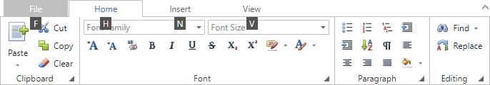

# Invoke Ribbon Commands
To select a specific command, you can click it with the mouse or invoke it via its access key. See below for more information.

Access keys are associated with each tab and command in the Ribbon. Access keys can be visualized using **key tips**. The key tips are little boxes displaying access keys. To see the key tips, press CTRL+SHIFT+[_access key_]. The access key is defined by your application vendor. Key tips will appear next to the corresponding tabs and commands.

Access keys can be composed of one, two or three symbols. 
If an access key is represented by one symbol, you can invoke the command by pressing the symbol shown in the key tip. 
If an access key is represented by two or three symbols, to invoke the command, press the symbols shown in the key tip one after another.

Initially, when pressing CTRL+SHIFT+[_access key_], key tips are displayed for tabs.

To invoke key tips for commands within a specific tab, press the access key associated with this tab.
To move from a specific tab back to displaying key tips for all tabs press ESC.

For example, to display key tips for commands within the **Home** tab (see the image above), press H:

