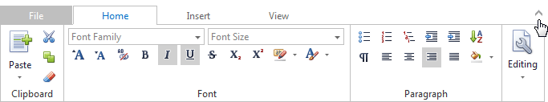
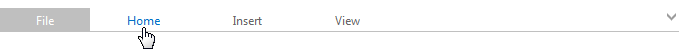

# Minimizing the Ribbon
To minimize a ribbon, use the **Minimize** button displayed in the top right corner of the ribbon.

When the ribbon is minimized, it displays a tab header only. Click a tab to display the content of that specific tab.

To maximize the ribbon, click the **Minimize** button once again.