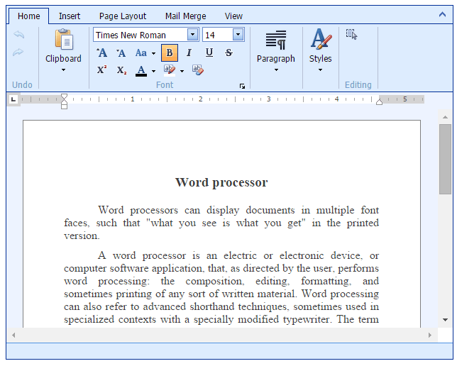

# Rich Text Editor
This section describes the capabilities provided by the **Rich Text Editor**.

&nbsp;

**Text Editor UI**
* [Editor Elements](rich-text-editor/text-editor-ui/editor-elements.md)
* [Ribbon Interface](rich-text-editor/text-editor-ui/ribbon-interface.md)

&nbsp;

**File Operations**
* [Create a New Document](rich-text-editor/file-operations/create-a-new-document.md)
* [Open a Document](rich-text-editor/file-operations/load-a-document.md)
* [Save a Document](rich-text-editor/file-operations/save-a-document.md)
* [Print a Document](rich-text-editor/file-operations/print-a-document.md)

&nbsp;

**Document Layout and Page Setup**
* [Insert a Page Break](rich-text-editor/document-layout-and-page-setup/insert-a-page-break.md)
* [Divide a Documents into Sections](rich-text-editor/document-layout-and-page-setup/divide-a-documents-into-sections.md)
* [Adjust Page Settings](rich-text-editor/document-layout-and-page-setup/adjust-page-settings.md)
* [Lay Out Text in Columns](rich-text-editor/document-layout-and-page-setup/lay-out-text-in-columns.md)
* [Page Color](rich-text-editor/document-layout-and-page-setup/page-color.md)

&nbsp;

**Viewing and Navigating**
* [Document Views](rich-text-editor/viewing-and-navigating/document-views.md)
* [Show Horizontal Ruler](rich-text-editor/viewing-and-navigating/show-horizontal-ruler.md)
* [Full Screen Mode](rich-text-editor/viewing-and-navigating/full-screen-mode.md)
* [Navigate through a Document](rich-text-editor/viewing-and-navigating/navigate-through-a-document.md)

&nbsp;

**Text Editing**
* [Select Text](rich-text-editor/text-editing/select-text.md)
* [Delete Text](rich-text-editor/text-editing/delete-text.md)
* [Cut, Copy and Paste Editor's Content](rich-text-editor/text-editing/cut-copy-and-paste-editors-content.md)
* [Undo and Redo Last Operations](rich-text-editor/text-editing/undo-and-redo-last-operations.md)

&nbsp;

**Formatting**
* [Format Text](rich-text-editor/formatting/format-text.md)
* [Format Paragraphs](rich-text-editor/formatting/format-paragraphs.md)
* [Using Tabs](rich-text-editor/formatting/using-tabs.md)
* [Using Indents](rich-text-editor/formatting/using-indents.md)
* [Apply Predefined Styles](rich-text-editor/formatting/apply-predefined-styles.md)

&nbsp;

**Pictures and Text Boxes**
* [Insert, Select, Copy or Delete a Picture or Text Box](rich-text-editor/pictures-and-text-boxes/insert-select-copy-or-delete-a-picture-or-text-box.md)
* [Move a Picture or Text Box](rich-text-editor/pictures-and-text-boxes/move-a-picture-or-text-box.md)
* [Resize a Picture or Text Box](rich-text-editor/pictures-and-text-boxes/resize-a-picture-or-text-box.md)
* [Rotate a Picture or Text Box](rich-text-editor/pictures-and-text-boxes/rotate-a-picture-or-text-box.md)
* [Wrap Text Around a Picture or Text Box](rich-text-editor/pictures-and-text-boxes/wrap-text-around-a-picture-or-text-box.md)
* [Add, Change or Delete a Border for a Picture or Text Box](rich-text-editor/pictures-and-text-boxes/add-change-or-delete-a-border-for-a-picture-or-text-box.md)
* [Add, Change or Delete a Text Box Fill](rich-text-editor/pictures-and-text-boxes/add-change-or-delete-a-text-box-fill.md)

&nbsp;

**Lists**
* [Numbered Lists](rich-text-editor/lists/numbered-lists.md)
* [Bulleted Lists](rich-text-editor/lists/bulleted-lists.md)
* [Multilevel Lists](rich-text-editor/lists/multilevel-lists.md)

&nbsp;

**Tables**
* [Tables](rich-text-editor/tables.md)

&nbsp;

**Find and Replace**
* [Find and Replace](rich-text-editor/find-and-replace.md)

&nbsp;

**Header and Footer**
* [Header and Footer](rich-text-editor/header-and-footer/header-and-footer.md)
* [Page Number and Count](rich-text-editor/header-and-footer/page-number-and-count.md)

&nbsp;

**Table of Contents**
* [Table of Contents](rich-text-editor/table-of-contents.md)

&nbsp;

**Mail Merge**
* [Mail Merge](rich-text-editor/mail-merge.md)

&nbsp;

**Keyboard Shortcuts**
* [File Operations](rich-text-editor/keyboard-shortcuts/file-operations.md)
* [Navigation inside Documents](rich-text-editor/keyboard-shortcuts/navigation-inside-documents.md)
* [Work with Selections ](rich-text-editor/keyboard-shortcuts/work-with-selections.md)
* [Copy, Paste and Edit the Content](rich-text-editor/keyboard-shortcuts/copy-paste-and-edit-the-content.md)
* [Text Formatting](rich-text-editor/keyboard-shortcuts/text-formatting.md)

&nbsp;

**Miscellaneous**

* [Bookmark and Hyperlink](rich-text-editor/miscellaneous/insert-a-hyperlink.md)
* [Insert a Symbol](rich-text-editor/miscellaneous/insert-a-symbol.md)