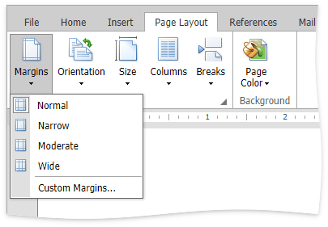

# Adjust Page Settings
When changing page layout settings (such as [page margins](#margins), [page orientation](#orientation), [paper size](#papersize)), you can apply them to the whole document or set specific page layout settings for each individual section if your [document is divided into sections](divide-a-documents-into-sections.md).

## <a name="margins"/>Change Page Margins
1. Click within a [section](divide-a-documents-into-sections.md) whose page margins you wish to set.
2. Select the **Page Layout** tab, click the **Margins** button in the **Page Setup** group and select the margin sizes to be set for the current section from the invoked list.
	
	
	
	Or specify page margins for the current section or the whole document via the **Page Setup** dialog.
	
	

## <a name="orientation"/>Change Page Orientation
1. Click within a [section](divide-a-documents-into-sections.md) for which you wish to specify page orientation.
2. Select the **Page Layout** tab, click the **Orientation** button in the **Page Setup** group and select **Portrait** or **Landscape** from the invoked list.
	
	
	
	Or set the page orientation for the current section or the whole document on the **Margins** tab of the **Page Setup** dialog.

## <a name="papersize"/>Change Paper Size
1. Click within a [section](divide-a-documents-into-sections.md) for which you wish to set the paper size.
2. Select the **Page Layout** tab, click the **Size** button in the **Page Setup** group and select one of the standard paper sizes from the invoked list.
	
	
	
	Or specify the paper size for the current section or the entire document on the **Paper** tab of the **Page Setup** dialog.
	
	