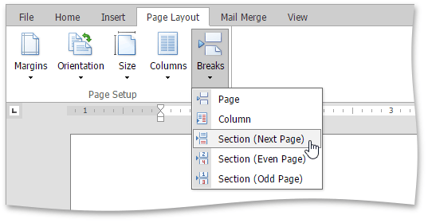
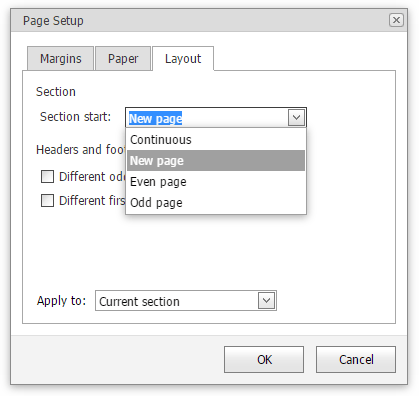

# Divide a Documents into Sections
You can divide your document into sections to specify parts of a document that have different [page settings](../../../../interface-elements-for-web/articles/rich-text-editor/document-layout-and-page-setup/adjust-page-settings.md) (page margins, page orientation, paper size) and [column layouts](../../../../interface-elements-for-web/articles/rich-text-editor/document-layout-and-page-setup/lay-out-text-in-columns.md).

## Insert Section Breaks
To divide a document into sections, insert section breaks.
1. Click where you want to inset a section break within a document.
2. Select the **Page Layout** tab, click the **Breaks** button in the **Page Setup** group and select the required [type of the section break](#sectionbreaktypes).
	
	

To show the section break mark, press **CTRL+SHIFT+8** or select the **Home** tab and click the  button in the **Paragraph** group.

In a document, section breaks are marked as illustrated below.

## <a name="sectionbreaktypes"/>Types of Section Breaks
* **Next Page** inserts a section break and starts a new section on the next page.
* **Even Page** inserts a section break and starts a new section on the next even-numbered page.
* **Odd Page** inserts a section break and starts a new section on the next odd-numbered page.

## Change Section Break Type
You can change the type of the section break that has been inserted to start a section. To do this, follow the instructions below.
1. Click the section following the section break that you wish to change.
2. Within the **Page Layout** tag, click in the right bottom corner of the **Page Setup** group to invoke the **Page Setup** dialog.
	
	
3. Change the **Section start** property on the **Layout** tab as required.
	
	