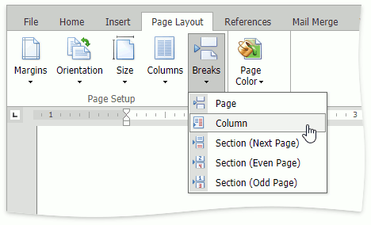

# Lay Out Text in Columns
To split a text into columns, follow the steps below.
1. Click within a [section](divide-a-documents-into-sections.md) which you wish to lay out in several columns.
2. Select the **Page Layout** tab, click the **Columns** button in the **Page Setup** group and select the number of columns into which the text should be split.
	
	
	
	Or click **More Columns** to invoke the **Columns** dialog where you can adjust the columns layout of the text in a more flexible way for the current section or the whole document.
	
	

To move the text to the next column (if the text in the current section is laid out into multiple columns), insert a column break.
1. Click within a document where you wish to insert a column break.
2. Select the **Page Layout** tab, click the **Breaks** button on the **Page Setup** group and select **Column** from the invoked list.
	
	
	
	Or press CTRL+SHIFT+ENTER.

To show the column break mark, press CTRL+SHIFT+8 or select the **Home** tab, click the  button in the **Paragraph** group.

In a document, column breaks are marked as illustrated below.

