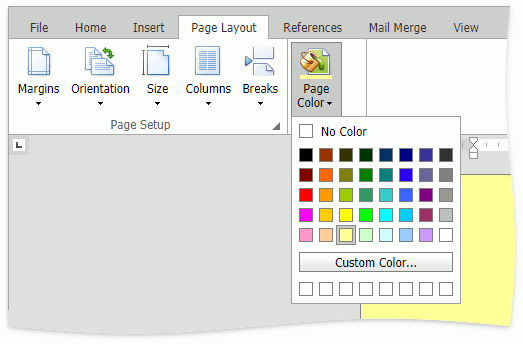
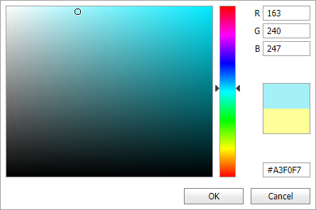

# Page Color

Click the **Page Color** button in **Page Layout** tab's **Background** group and select the color from the drop-down color palette to specify the document's page color.

 

## Custom Color

Click the **Custom Color...** button, and in the invoked drop-down box, select a custom color and click **OK**.  The color is added to the custom color palette under the **Custom Color...** button.

You can specify a color in the following text formats:

**RGB Format**

Use the **R**, **G**, and **B** editors to specify a color in RGB (red, green, blue) format. Each parameter (red, green, and blue) defines the color intensity and must be an integer between 0 and 255.

**Longhand and Shorthand hexadecimal notation** 

Use a text editor at the bottom of the color editor to specify a color in longhand or shorthand hexadecimal notation. 

Longhand hexadecimal notation is in #RRGGBB format (for example, #00FFFF, 2fa135, #abcdef), where RR is red, GG is green, and BB is blue. These hexadecimal integers specify the color components. All values must be between 0 and FF. The hash (#) sign can be skipped.

Shorthand hexadecimal notation is in #RGB format (for example, #0FF, 21f, #afa), where R is red, G is green, and B is blue. These hexadecimal integers specify the color components. All values must be between 0 and F. The hash (#) sign can be skipped.
