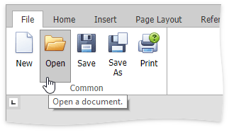
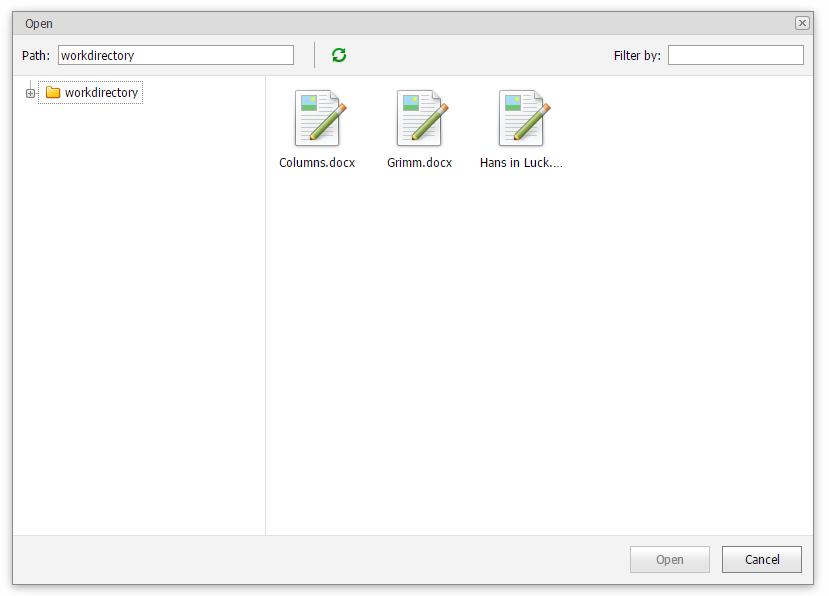

# Open a Document
To open a document, select the **File** tab, and click the **Open** button in the **Common** group; or press CTRL+O.

The **Open** dialog appears, allowing you to select a file from your working directory.

The **Rich Editor** enables you to open documents of the following types:
* Rich Text Format (*.rtf)
* Text Files format (*.txt)
* Hyper Text Markup Language format (*.htm, *.html)
* Web page archive format (*.mht)
* Microsoft Word 97-2003 format (*.doc)
* WordML (*.xml)
* Open Office XML format (aka Office 2007 or *.docx)
* Open Document Format (*.odt)
* Electronic Publication (*.epub)