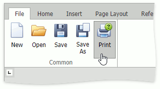

# Print a Document
1. Select the **File** tab and click the **Print** button in the **Common** group; or press CTRL+P.
	
	
	
	The **Print** dialog will be invoked.
	

2. In the **Print** dialog, specify all required settings and click **Print**.