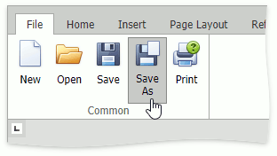

# Save a Document
To save a document, go to the **File** tab, and then click the **Save as** button in the **Common** group; or press CTRL+S.

After that, the **Save as** dialog box is invoked.

Specify whether the file should be saved to the server or downloaded as a copy. Then, specify the folder path, file name and the file format in which to save the document.

The **Rich Edit** control allows you to save documents in the following formats:
* Rich Text Format (*.rtf)
* Text Files format (*.txt)
* Hyper Text Markup Language format (*.htm, *.html)
* Web page archive format (*.mht)
* Microsoft Word 97-2003 format (*.doc)
* WordML (*.xml)
* Open Office XML format (aka Office 2007 or *.docx)
* Open Document Format (*.odt)
* Electronic Publication (*.epub)

To save the active document with its current file format and location, go to the **File** tab, and then click the **Save** button in the **Common** group. If you click the **Save** button to save a newly created document, the **Save as** dialog is invoked.

> [!NOTE]
> When saving a document in HTML format, in-line pictures are saved in the %FileName%_files folder, where %FileName% is the name of the document file. Image files are named "imageN.png", where N is the picture index starting from the beginning of the document.