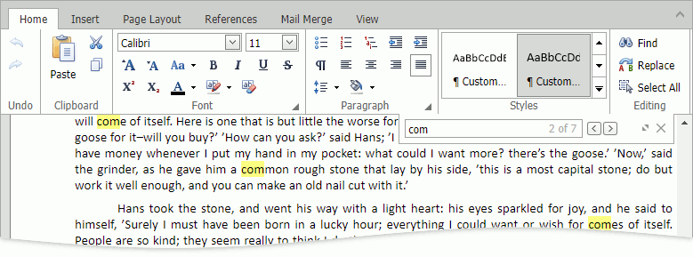
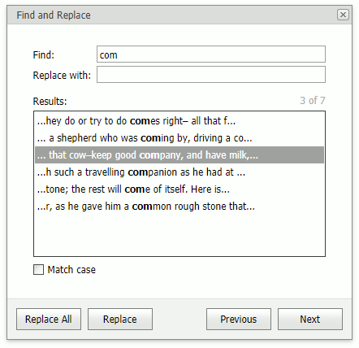

# Find and Replace

You can use the **Search Panel** and the **Find and Replace** dialog to locate and replace text within a document.

## Search Panel
The **Search Panel** allows you to search text and navigate through search results. To invoke the search panel, use the **Find** ribbon command or press CTRL+F.

Type the search text in the panel edit box. Use the **Previous** and **Next** buttons to navigate through the results.

## Find and Replace Dialog 
The **Find and Replace** dialog allows you to search text, navigate through search results, and replace this text in the results (one by one or all at once). To invoke the dialog, click the corresponding button in the **Search Panel**, click the **Replace** ribbon command, or press CTRL+H.

Type the search text in the **Find** edit box. Select the **Match case** checkbox for case-sensitive search. You can navigate through the results using the **Previous** and **Next** buttons or by selecting a result in the **Results** section.

 
To replace a search result, specify the replacement text in the **Replace with** edit box, select a search result, and click **Replace**. To replace all the search results, click **Replace All**.

