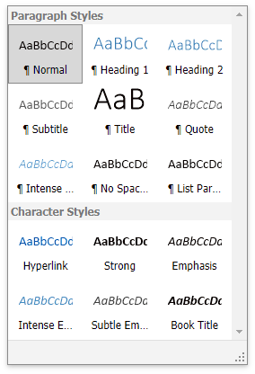

# Apply Predefined Styles
To format a text or a paragraph you can apply styles. A style is a group of formatting characteristics. All these characteristics are applied to a text or a paragraph at once when you apply a style. Thus, styles allow you to change text and paragraph appearance more quickly than setting all formatting characteristics separately ([Format Text](format-text.md), [Format Paragraphs](format-paragraphs.md)).

A **character based style** includes characteristics to format text within a paragraph (e.g., font type and size,  bold and italic formats, etc.)

A **paragraph based style** affects paragraph formatting characteristics such as text alignment, line spacing, etc. It can also include character formatting characteristics.

To apply a style, do the following.
1. [Select text](../text-editing/select-text.md) or a paragraph that you want to format.
2. Click the required style name in the **Styles** box in the **Styles** group within the **Home** tab.
	
	