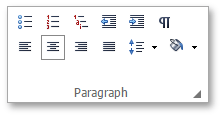
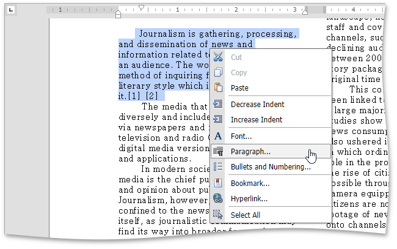
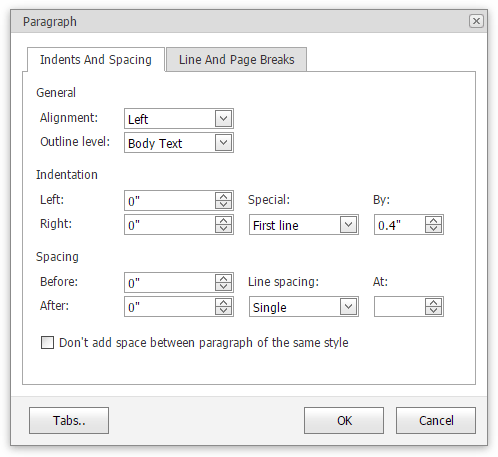

# Format Paragraphs
To format a paragraph, first click anywhere in it or [select](../text-editing/select-text.md) the paragraph, and then use the **Paragraph** group on the **Home** tab to create a [bulleted](../lists/bulleted-lists.md), [numbered](../lists/numbered-lists.md) and [multilevel](../lists/multilevel-lists.md) list, change line spacing, indentation, alignment and styles.

Also, you can use the **Paragraph** dialog to format the paragraph. To invoke this dialog, right-click the paragraph and click the arrow in the right bottom corner of the **Paragraph** group or select the **Paragraph** item from the context menu.

The **Paragraph** dialog appears, as illustrated below.

In this dialog, you can change different parameters for the paragraph (**Indents and Spacing** tab) and pagination (**Line and Page Breaks** tab).