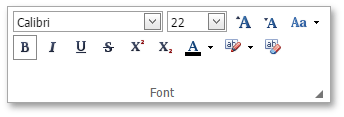
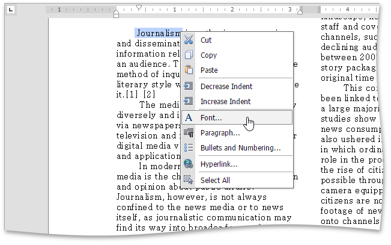
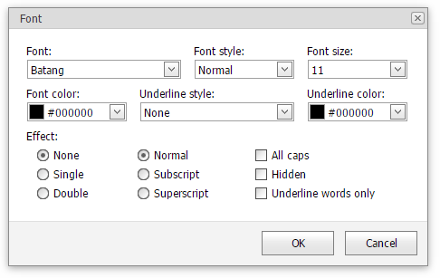

# Format Text
To format text, first [select it](../text-editing/select-text.md) and then use the **Font** group in the **Home** tab to change the font family, size, color, clear formatting etc.

Also, you can modify the font using the **Font** dialog. Select the text that you want to format, right-click it and choose the **Font** item from the context menu or click the arrow in the right bottom corner of the **Font** group within the **Home** tab.

The **Font** dialog appears as illustrated below.

In this dialog, you can specify all required font parameters, and apply them to the selected text.

In addition, the **Rich Editor** provides a list of default keyboard shortcuts for text formatting:

|  |  |
|---|---|
| CTRL+B | Toggles the bold style on the selection. |
| CTRL+I | Toggles the italic style on the selection. |
| CTRL+U | Toggles the underline style on the selection. |