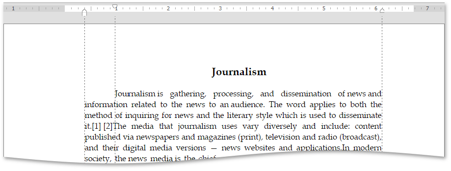
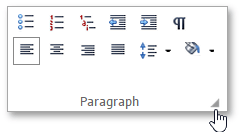
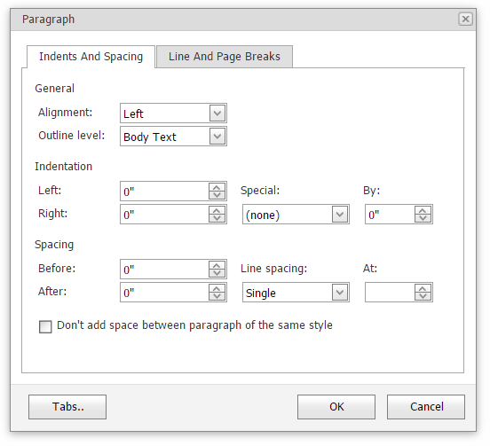
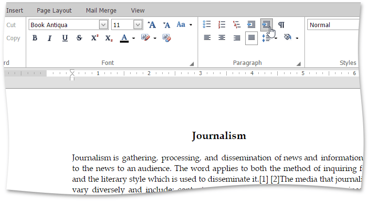

# Using Indents
You can set or modify a first line indent, right indent, left indent and hanging indent of a paragraph by using the [horizontal ruler](#ruler), [dialog box](#dialog_box), [Increase/Decrease Indent buttons](#buttons) or [context menu](#contextmenu).

 Press TAB to create the first line indent on the keyboard. Each pressing the TAB key moves the first line indent to 0,5 inch.

## <a name="ruler"/>Changing Indents by Using the Ruler
**Rich Text Editor** provides indent markers of the following types.

To set or modify indents by using the ruler,  do the following:
* Click anywhere in a paragraph that will be formatted or select one or more paragraphs.
* Move an indent marker to a specific position on the ruler.
	
	

## <a name="dialog_box"/>Changing Indents by Using the Dialog Box
To set or modify indents by using the dialog box,  do the following:
* Click anywhere within a paragraph that will be formatted or select one or more paragraphs.
* Select the **Page Layout** tab, and click in the right bottom corner of the **Paragraph** group.
	
	
	
	Specify indents settings within the invoked **Paragraph** dialog box and click **OK**.
	
	

## <a name="buttons"/>Changing Indents by Using Increase/Decrease Indent Buttons
To set or modify indents by using the **Increase/Decrease Indent** buttons, do the following:
* Click anywhere within a paragraph that will be formatted or select one or more paragraphs.
* Select the **Home** tab, and click the  **Increase Indent**  or **Decrease Indent**  button in the **Paragraph** group. **Increase Indent** and **Decrease indent** buttons   increases and decreases the indent by increments of 0.5 inch respectively.
	
	

## <a name="contextmenu"/>Changing Indents by Using Context Menu
To set or modify indents by using the context menu, do the following:
* Right-click anywhere within a paragraph that will be formatted or select one or more paragraphs.
* In the invoked menu click the **Increase Indent**  or **Decrease Indent**  command. **Increase Indent** and **Decrease indent** commands increase and decrease the indent by increments of 0.5 inch respectively.
	
	