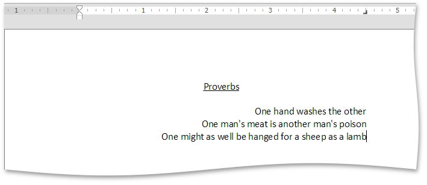
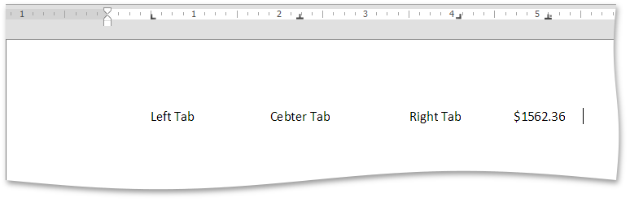
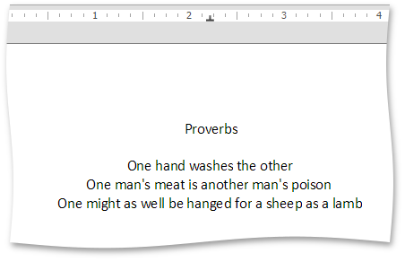
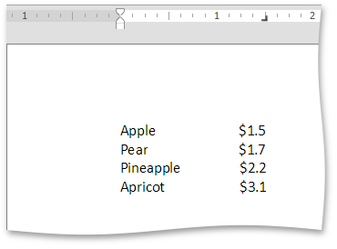
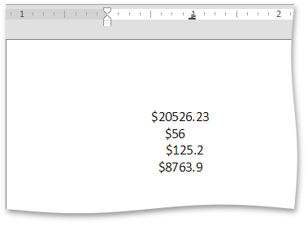
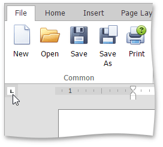
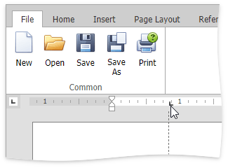
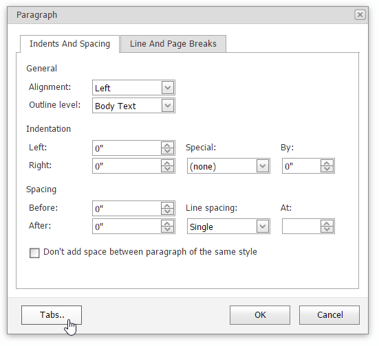

# Using Tabs
Tab stops specify the exact positions the cursor moves after repeatedly pressing the TAB key. Tab stops are located on the [horizontal ruler](../viewing-and-navigating/show-horizontal-ruler.md) and allows you to align text.

Depending upon [types of tab stops](#tab_types), typed text can be extended to the right, left or center position of the tab.

You can set any type of tab stops either [by using the ruler](#ruler) or [by using the dialog box](#dialog_box).

> [!NOTE]
> There are no tab stops on the ruler when you create a new document.

## <a name="tab_types"/>Types of Tab Stops
| Type of a Tab Stop | Example |
|---|---|
|  - **Left Tab**. The start position of text is located to the right of the tab. Text will move to the right. |  |
|  - **Center Tab**. The cursor is located in the middle of the tab. Text will be centered based on the tab position. |  |
|  - **Right Tab**. The start position of text is located to the left of the tab. Text will move to the left. |  |
|  - **Decimal Tab**. The tab position specifies the location of the decimal point. Text before the decimal point extends to the left and text after the decimal point, extends to the right. |  |

## <a name="ruler"/>Set Tab Stops by Using the Ruler
To set a tab stop by using the ruler, do the following:
* Click the tab selector at the left end of the horizontal ruler until it displays the [type of tab](#tab_types) that you want.
	
	
* Click on the ruler to set a tab stop at a specific position.
	
	

## <a name="dialog_box"/>Set Tab Stops by Using the Tab Dialog Box
To set a tab stop by using the dialog box, do the following:
* Select the **Page Layout** tab, and click in the right bottom corner of the **Paragraph** group.
	
	
	
	The **Paragraph** dialog box is invoked.
	
	
* In the invoked **Paragraph** dialog box, click the **Tabs..** button. The **Tabs** dialog box is invoked.
	
	
* In the opened **Tabs** dialog box, specify a tab stop's settings and click the **Set** button.
	
	
* Repeat the previous steps for each tab stop and click **OK**.
	
	

You can drag any existing tab stop along the horizontal ruler to a different position.