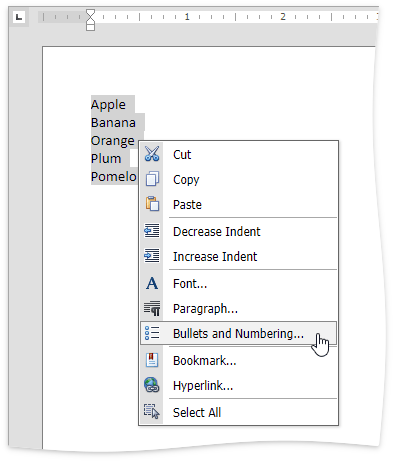

# Numbered Lists
## Create a Numbered List as You Type
1. Point to the position within a document from which you want to begin your list.
2. Click the **Numbering**  button in the **Paragraph** group in the **Home** tab.
	
	
3. Type the text.
4. Press ENTER to create the next item of the list.
5. To finish the list, press ENTER twice.

## Make a Numbered List from the Selected Text
You can add numbers to existing lines of text in two ways. The first one is to use the **Paragraph** group in the **Home** tab:
1. Select the text lines that you want to transform into a list.
2. Click the **Numbering**  button in the **Paragraph** group within the **Home** tab.

Another way to do the same thing is to use the [context menu](../text-editor-ui/editor-elements.md):
1. Select the text to be transformed into a list.
2. Right-click in the document and select the **Bullets and Numbering** item from the appeared context menu.
	
	
3. In the invoked **Bulleted and Numbering** dialog, click the **Numbered** tab and choose the list style that you want to apply.
	
	

## Create Your Own List Style
You can create your own style for a numbered list on the basis of one of the existing list styles, by changing different list parameters.
1. Select the numbered list (or text to be transformed into the numbered list) to which you want to apply your own style.
2. Right-click in the document and select the **Bullets and Numbering** item from the invoked [context menu](../text-editor-ui/editor-elements.md). The **Bullets and Numbering** dialog will be displayed.
	
	
3. Click the **Numbered** tab, choose one of the existing styles and click **Customize...**. The **Customize Numbered List** dialog will be invoked.
	
	
	
	> [!NOTE]
	> The **Customize...** button is disabled if the **None** item of the **Bullets and Numbering** dialog is selected.
4. In this dialog, change different list parameters to create your own list style.
	
	For instance, if you specify list parameters in the following way,...
	
	
	
	...you will get the list style as illustrated below.
	
	