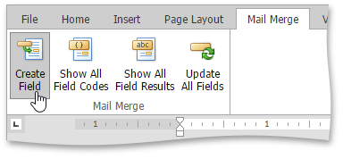

# Mail Merge
Document fields are placeholders for non-static data that can change (updated on a field update). These placeholders are replaced with actual data when the document is rendered. Use buttons in the **Mail Merge** tab to manage these fields.

To insert a field, place the mouse cursor in a document and click the **Create Field** button in the **Mail Merge** tab (or press CTRL+F9).

You can use the following field codes:

* **DATE** - Inserts the current date and time.
* **TIME** - Inserts the current time.
* **PAGE** - Inserts the number of the page containing the field.
* **NUMPAGES** - Inserts the total number of pages.
* **MERGEFIELD** - Inserts a field merged with a data source.
* **DOCVARIABLE** - Enables you to programmatically insert complex content when this field is updated.

The **Show All Field Codes** button displays field codes for all the fields in the document.

The **Show All Field Results** button displays field results for all the fields in the document.

Fields should be updated to calculate a field result. Fields are updated automatically when the document is saved or printed. 

Click the **Update All Fields** button to update fields, or select a field(s) and press F9.

