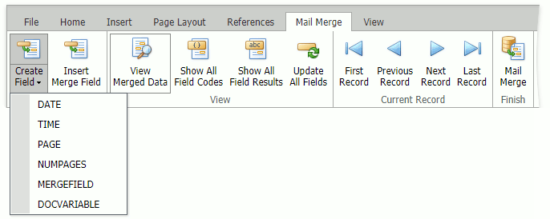

# Mail Merge
Document fields are special placeholders for non-static data that might change (be updated on a field update). These placeholders are replaced with actual data when the document is rendered for display or printing. The default **Mail Merge** tab can be used to work with fields.

To insert a field, position the mouse cursor within a document and click the **Create Field** button in the **Mail Merge** tab (or use the CTRL+F9 shortcut). Field codes appear between curly brackets ( { } ).

The following field codes are supported:

* **DATE** - Inserts the current date and time.
* **TIME** - Inserts the current time.
* **PAGE** - Inserts the number of the page containing the field.
* **NUMPAGES** - Inserts the total number of pages.
* **MERGEFIELD** - Inserts a field merged with a data source.
* **DOCVARIABLE** - Enables you to programmatically insert complex content when this field is updated.

The **Show All Field Codes** button displays field codes for all fields in the document.

The **Show All Field Results** button displays field results for all fields in the document.

To calculate the field result, a field needs to be updated. Fields are updated automatically when the document is saved or printed. However, you can update a field on demand by clicking the **Update All Fields** button, or select the required field(s) and press F9.

