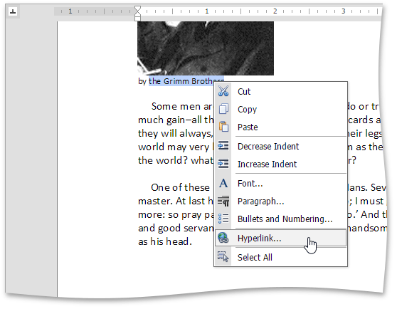
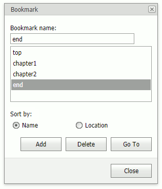
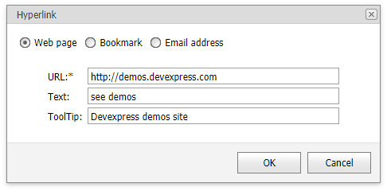
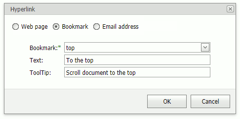
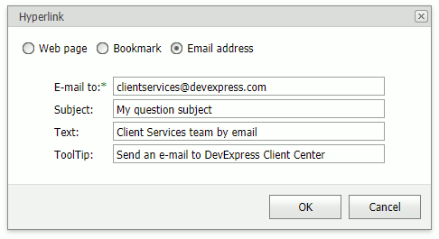

# Bookmark and Hyperlink
You can add hyperlinks to external locations or associated with bookmarks in the same document.

## Bookmarks

A bookmark can refer to a position in a document or to a document range (for example, portion of text, image).

### Add a bookmark
* Select a document range or position the pointer.
* Click the **Bookmark** button in **Insert** tab's **Links** group...

...or right-click the selected document range and select the **Bookmark...** command in the context menu.

This invokes the **Bookmark** dialog box.

* Specify a bookmark name and click **Add**. 

> [!NOTE]
> A bookmark name can contain numbers, letters, and the underscore symbol ("_"), and must begin with a letter.

### Delete a bookmark
Invoke the **Bookmark** dialog, select a bookmark, and click **Delete**.

### Bookmark navigation
Invoke the **Bookmark** dialog, select a bookmark, and click **Go To** to navigate to the bookmark.

## Hyperlinks

A hyperlink is a document range (for example, portion of text, image) that you can use to go to a webpage, to another place within the same document, or to create a new email message. 

Click a hyperlink while pressing CTRL to navigate to the link.

### Add a hyperlink
* Select a document range and click **Hyperlink** in **Insert** tab's **Links** group, or right-click the selected document range and click **Hyperlink...** in the context menu to invoke the **Hyperlink** dialog box.
 
*Use the option buttons at the top of the dialog to change the hyperlink's destination.

**Web page**

Inserts a hyperlink to a web page. 

Specify the hyperlink's navigation URL (required), text, and tooltip, and click **OK**. 

**Bookmark**

Inserts a hyperlink to a bookmark in the same document. 

Select a bookmark's name from the drop-down list (required), and specify the hyperlink's navigation text and tooltip, and click **OK**. 

**Email address**

Inserts a hyperlink that creates a new email message. 

Specify an email address (required), message subject, link text and tooltip, and click **OK**.

> [!NOTE]
> Hyperlink's text automatically appears in the **Text** editor when it is specified for a portion of text. You cannot specify hyperlink text for some elements, for example, images. 

