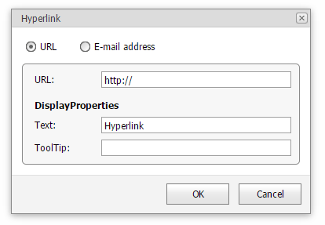

# Insert a Hyperlink
The **Hyperlink** marks the document range as a hot spot in the document. It can be activated by clicking or pressing **ENTER** to navigate the specified external URL.

To create a new hyperlink, select a range to mark and click the **Hyperlink** button in the **Links** group in the **Insert** tab...

...or select the **Hyperlink...** item from the context menu.

The **Hyperlink** dialog will appear.

