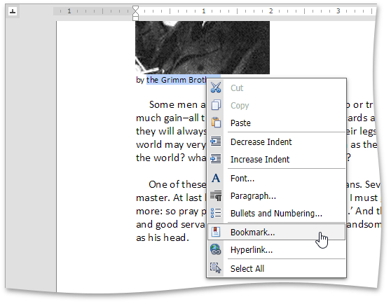

# Bookmark and Hyperlink
You can add hyperlinks pointing to external locations or associated with bookmarks in the same document.

## Bookmarks

A bookmark can refer to a particular position in a document or to a document range (e.g. portion of text, image).

To create a new bookmark place the pointer to the required position or select the required document range. Click the **Bookmark** button in the **Links** group in the **Insert** tab.

Or right-click the selected document range and click the **Bookmark...** command in the context menu.

The **Bookmark** dialog will appear.

Specify a bookmark name and click **Add**. Note that bookmark name can contain numbers, letters, and the underscore symbol ("_"), and must begin with a letter.

To delete a bookmark, invoke the **Bookmark** dialog, select the required bookmark, and click **Delete**.

To navigate through bookmarks, invoke the **Bookmark** dialog, select required bookmark in a list and click **Go To**.

## Hyperlinks

A hyperlink marks a document range (e.g. portion of text, image) as a hot spot in the document. Click a hyperlink while pressing CTRL to follow the link.

To create a new hyperlink, select a document range and click the **Hyperlink** button in the **Links** group in the **Insert** tab.
 
Or right-click the selected document range and click the **Hyperlink...** command in the context menu.
 
The **Hyperlink** dialog will appear. 
 
Use the option buttons at the top of the dialog to change the hyperlink direction.

**Web page**

Inserts a hyperlink to a web page. 
Specify the hyperlink navigation URL (required), text, and tooltip, and click **OK**. 

**Bookmark**

Inserts a hyperlink to a bookmark in the same document. 
Select a bookmark name from the dropdown list (required), and specify the hyperlink navigation text, and tooltip, and click **OK**. 

**Email address**

Inserts a hyperlink, which when clicked, creates a new email message. 
Specify an email address (required), message subject, link text and tooltip, and click **OK**.

> [!NOTE]
> If a hyperlink is specified for a portion of text, it automatically appears in the **Text** editor. For some elements, e.g. images, you can not specify hyperlink text. 

