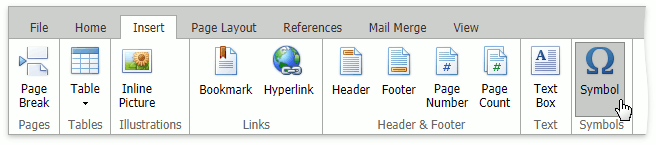
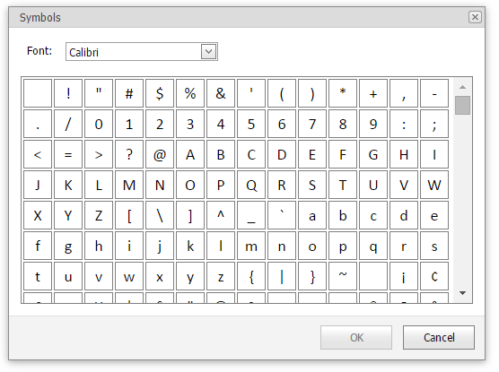

# Insert a Symbol
The **Rich Text Editor** allows you to insert symbols that are not on your keyboard, such as copyright symbols, trademark symbols, paragraph marks.

To insert a symbol, do the following.
1. Point to the position in the document where you want to insert a symbol.
2. Select the **Insert** tab, and click the **Symbol** button in the **Symbols** group.
	
	
	
	The **Symbol** dialog will be invoked.
	
	
3. Select the symbol to be inserted and click **OK** or double-click the symbol.