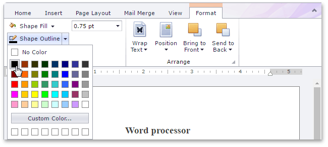
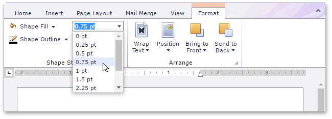
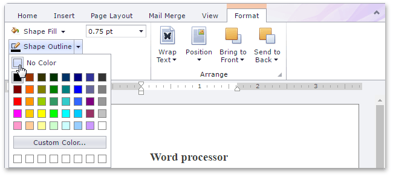

# Add, Change or Delete a Border for a Picture or Text Box
You can specify the color and weight of the outside border of a floating picture or text box, or fully delete the border.

## Set the Color of a Picture or Text Box Border
1. [Select](insert-select-copy-or-delete-a-picture-or-text-box.md) the floating picture or text box whose outline border color you wish to specify.
2. On the **Format** tab, in the **Shape Styles** group, click **Shape Outline** and select the required color.
	
	
	
	> [!NOTE]
	> By default, a floating picture is inserted with no border. To specify a colored outline border for a picture, a border weight must be set.

## Set the Weight of a Picture or Text Box Border
1. [Select](insert-select-copy-or-delete-a-picture-or-text-box.md) a floating picture or text box whose outline border weight you wish to specify.
2. Select the required border weight from the **Shape Outline Weight** list accessed on the **Format tab**, in the **Shape Styles** group.
	
	

## Remove a Picture or Text Box Border
1. [Select](insert-select-copy-or-delete-a-picture-or-text-box.md) a floating picture or text box whose outline border you wish to remove.
2. On the **Format** tab, in the **Shape Styles** group, click **Shape Outline** button and select **No Color**.
	
	