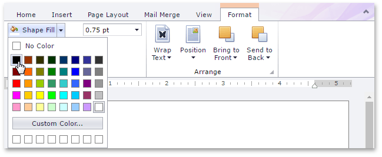

You can fill the floating text box with a specified color or delete the filling

## Specify a Text Box Fill
1. [Select](../../../../interface-elements-for-web/articles/rich-text-editor/pictures-and-text-boxes/insert-select-copy-or-delete-a-picture-or-text-box.md) a text box whose background you wish to color.
2. On the **Format** tab, in the **Shape Styles** group, click the **Shape Fill** button and select the required color.
	
	

## Delete a Text Box Fill
1. [Select](../../../../interface-elements-for-web/articles/rich-text-editor/pictures-and-text-boxes/insert-select-copy-or-delete-a-picture-or-text-box.md) a text box whose fill you wish to remove.
2. On the **Format** tab, in the **Shape Styles** group, click **Shape Fill** button and select **No Color**.
	
	