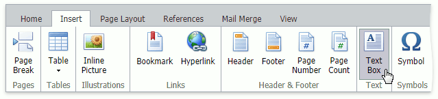

# Insert, Select, Copy or Delete a Picture or Text Box
You can insert floating [images](#image) or [text boxes](#textbox) and  [select](#select) them for [copying](#copy) or [deleting](#delete).

## <a name="image"/>Insert a Picture
Position the caret to the desired location and click the **Inline Picture** button in the **Insert** tab's **Illustrations** group to insert an inline picture into the document. 

In the invoked **Insert Image** dialog box, enter an image's web address (to load a picture from the web) or locate the required folder and select a file with graphics (to load pictures from your computer). Click **Insert** to insert the picture into the document.

The **Rich Text Editor** enables you to insert graphics of the following types:
* JPEG File Interchange Format (*.jpe, *.jpg, *.jpeg)
* Portable Network Graphics (*.png)
* Graphics Interchange Format (*.gif)

## <a name="textbox"/>Insert a Text Box
Position the caret at the desired location and click the **Text Box** button in the **Insert** tab's **Text** group to insert a text box into your document.

## <a name="select"/>Select a Picture or Text Box
Click a picture/text box's border to select it. 

> [!NOTE]
> Place the caret inside the text box to modify its content. Note that it is impossible to move, copy or delete the text box.

## <a name="copy"/>Copy/Paste a Picture or Text Box
To copy floating images and text boxes within a document, do the following: 
1. [Select](#select) a picture/text box to be copied.
2. On the **Home** tab, in the **Clipboard** group, click **Copy**, or select it from the context menu, or press CTRL+C.
3. Position the caret at the location for inserting the copied picture/text box.
4. On the **Home** tab, in the **Clipboard** group, click **Paste**, or select it from the context menu, or press CTRL+V.

To delete an image or text box follow the instructions below.

## <a name="delete"/>Delete a Picture or Text Box
1. [Select](#select) a picture/text box.
2. Press DELETE or BACKSPACE.
