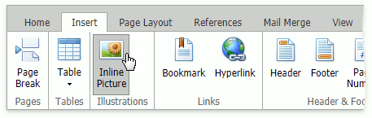
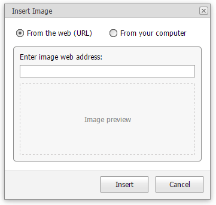

# Insert, Select, Copy or Delete a Picture or Text Box
You can insert floating [images](#image) or [text boxes](#textbox) and  [select](#select) them for [copying](#copy) or [deleting](#delete).

## <a name="image"/>Insert a Picture
To insert an inline picture into your document, position the caret to the desired location and click the **Inline Picture** button placed in the **Illustrations** group in the **Insert** tab.

In the invoked **Insert Image** dialog box, enter an image's web address (if you are going to load a picture from the web) or locate the required folder and select a file with graphics (if you are going to load pictures from your computer). Click Insert. The picture will be inserted into the document.

The **Rich Text Editor** enables you to insert graphics of the following types:
* Bitmap (*.bmp, *.dib)
* JPEG File Interchange Format (*.jpg, *.jpeg)
* Portable Network Graphics (*.png)
* Graphics Interchange Format (*.gif)
* Tagged Image Format (*.tif, *.tiff)
* Microsoft Enhanced Metafile (*.emf)
* Windows  Metafile (*.wmf)

## <a name="textbox"/>Insert a Text Box
To insert a text box into your document, position the caret at the desired location and on the **Insert** tab, in the **Text** group, click the **Text Box** button.

## <a name="select"/>Select a Picture or Text Box
To select a picture/text box, click on its border.

> If the caret is placed inside the text box, you can modify the text box content, but it is impossible to move, copy or delete the text box.

## <a name="copy"/>Copy/Paste a Picture or Text Box
You can copy floating images and text boxes within a document by performing the following instructions.
1. [Select](#select) a picture/text box to be copied.
2. On the **Home** tab, in the **Clipboard** group, click **Copy**, or select it from the context menu, or press **CTRL+C**.
3. Position the caret at the location where you want to insert the copy of the selected picture/text box.
4. On the **Home** tab, in the **Clipboard** group, click **Paste**, or select it from the context menu, or press **CTRL+V**.

To delete an image or text box follow the instructions below.

## <a name="delete"/>Delete a Picture or Text Box
1. [Select](#select) a picture/text box that you wish to remove.
2. Press **DELETE** or **BACKSPACE**