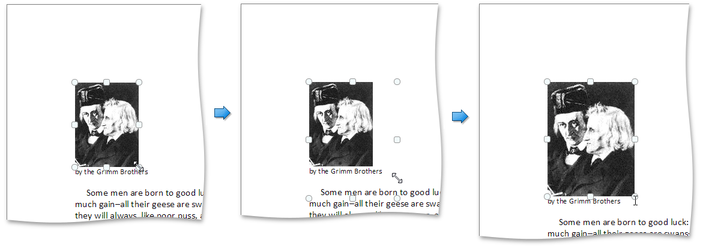
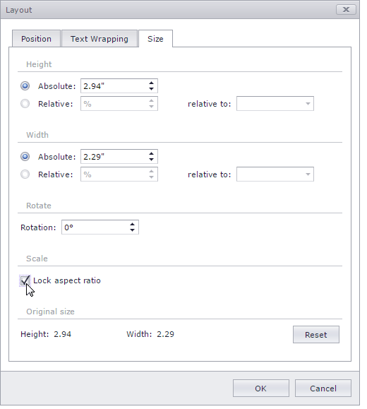

# Resize a Picture or Text Box
To resize a picture or text box, shrink or stretch an object in the following way.
1. [Select](insert-select-copy-or-delete-a-picture-or-text-box.md) a floating picture or text box to be resized.
2. Drag a _sizing handle_ towards or away from the object center until the required size is reached. Note that an object keeps its proportions during resizing.
	
	

To keep object proportions when resizing it, check the **Lock aspect ratio** option (to access it, open the context menu of the floating object, select **More Layout Options...**, then open the **Size** tab in the invoked **Layout** dialog. In this case, when you change a width of the object by dragging a _corner sizing handle_, the object's height will be automatically changed to maintain exact proportions of the object and vice-versa.

To specify an exact height and width of the object, clear the **Lock aspect ratio** check box.