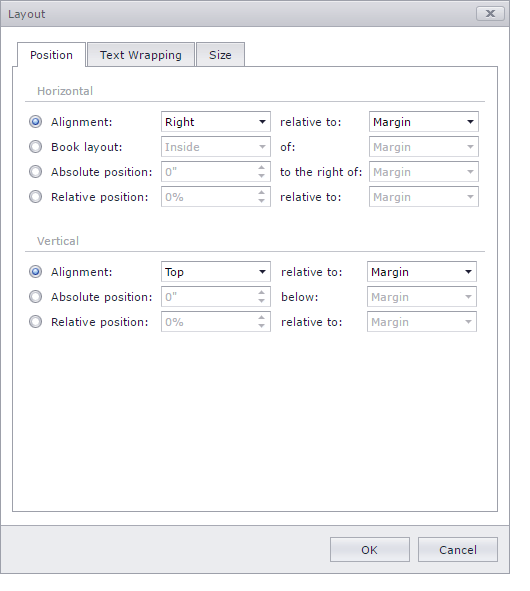
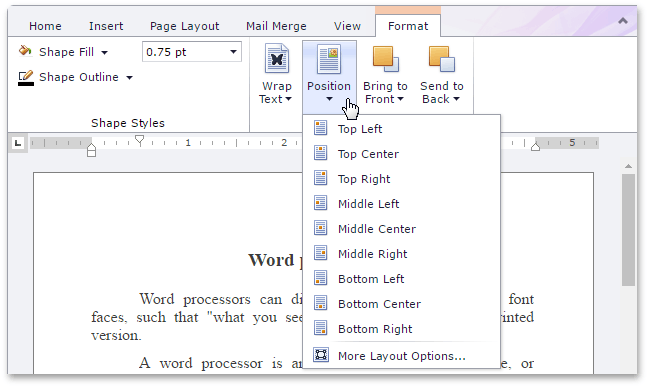
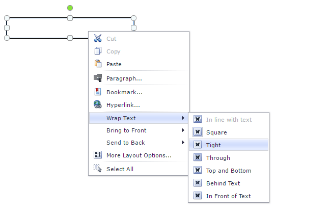
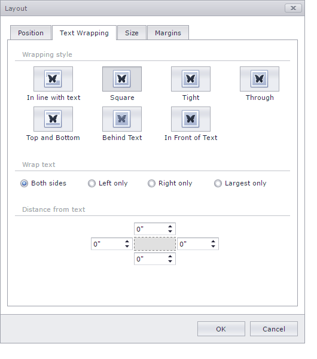

# Wrap Text Around a Picture or Text Box
## Position a Picture or Text Box within a Document
1. [Select](insert-select-copy-or-delete-a-picture-or-text-box.md) a floating picture or text box whose location you want to specify.
2. Specify an object location in one of the following ways.
	* On the **Format** tab, in the **Arrange** group, click the **Position** button and select the required position of the object from the invoked list.
		
		
	* Right-click the object to be positioned and select the **More Layout Options...** item from the context menu. On the **Position** tab of the invoked **Layout** dialog, specify the required position for the floating object.
		
		

## Wrap Text around Picture or Text Box
1. [Select](insert-select-copy-or-delete-a-picture-or-text-box.md) a floating picture or a text box.
2. To specify a way text wraps around the selected object, do one of the following.
	* On the **Format** tab, in the **Arrange** group, click **Wrap Text** and select the required type of text wrapping around the selected object from the invoked list.
		
		
	* Right-click the selected floating object, and select the required type of the text wrapping from the **Wrap Text** sub-menu of the invoked context menu.
		
		
	* Right-click the selected floating object, and select the **More Layout Options...** item from the context menu. Switch to the **Text Wrapping** tab of the invoked **Layout** dialog and specify the required text wrapping settings for the floating object.
		
		