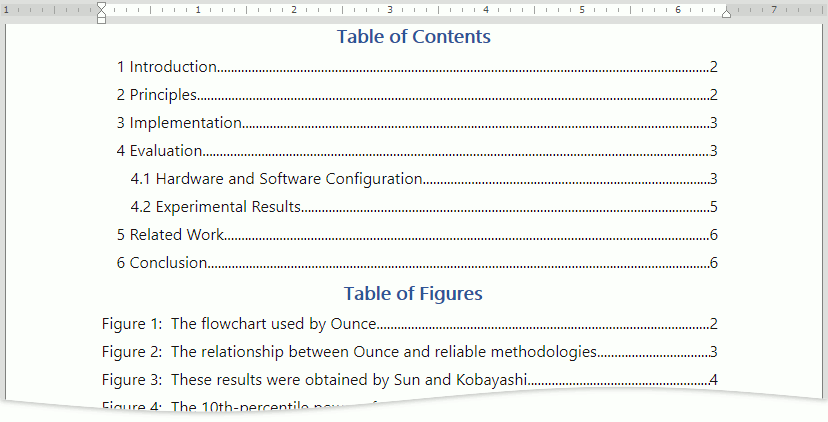
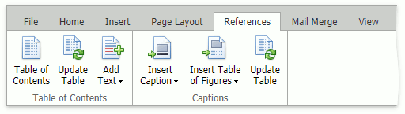
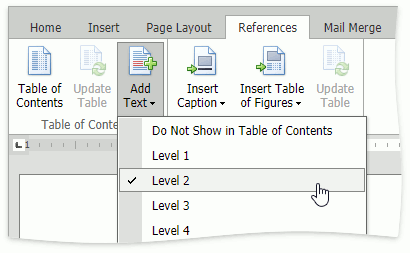
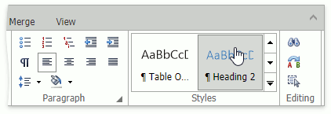
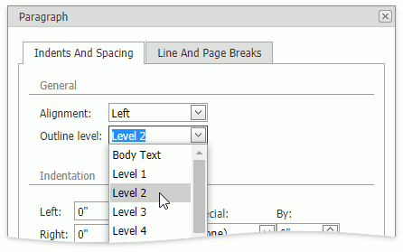

# Table of Contents

The Table of Contents allows you to navigate through a document's marked content (paragraphs, images, tables, and equations). Click a table's row while pressing CTRL to move to the heading or figure.

The **Table of Contents** lists a document's headings.

The **Table of Figures/Tables/Equations** lists document objects: figures, tables, or equations. 

Use the **References** tab's buttons to manage the navigation tables, mark paragraphs as headings, add captions to objects, and update the tables.

 
## Add a Heading to a Table of Contents
Select a heading text or place the pointer in a heading text and do one of the following:
* Click the **Add Text** button in the **References** tab and select a heading level.

* Select a heading style in the [Styles](formatting/apply-predefined-styles.md) box in the **Home** tab.

* Right-click the heading text, select the **Paragraph** command in the context menu, and select a heading level in the **Outline level** drop-down menu.

Update the table of contents.

## Remove a Heading from a Table of Contents
Delete a heading text to remove it from a table of contents.

To remove a heading from a table of contents but leave it in the document, select the heading text or place the pointer in the heading text, and do one of the following:
* Click the **Add Text** button in the **References** tab and select **Do Not Show in Table of Contents**.
* Select non-heading style in the **Styles** box in the **Home** tab.
* Right-click the heading text, select the **Paragraph** in the context menu, and select **Body Text** in the **Outline level** drop-down menu.

Update the table of contents.

## Add an Image, Table, or Equation to a Table of Figures
* Place the pointer after a figure.
* Click the **Insert Caption** button in the **References** tab and select the figure command. The figure name and number appear. 
* Type the figure caption after its number.
* Update the table of figures.

## Remove an Image, Table, or Equation from a Table of Figures
Clear a figure name and update the table to remove the figure from a table. 

## Insert a Table of Contents or Figures
Click the **Table of Contents** button in the **References** tab to insert a table of contexts. 

Click the **Insert Table of Figures** button in the **References** tab and select a command to insert a table of figures.

## Update a Table
If a navigation table displays outdated information (outdated headings/captions or outdated page numbers) after changing the document, place the pointer in the table and click the **Update Table** button in the **References** ribbon tab to update the table and display the correct information.

