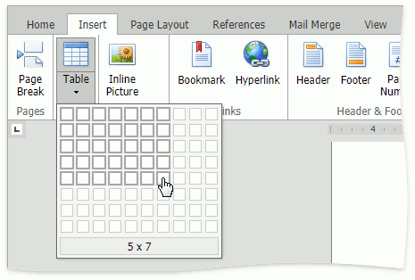
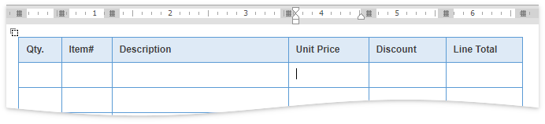
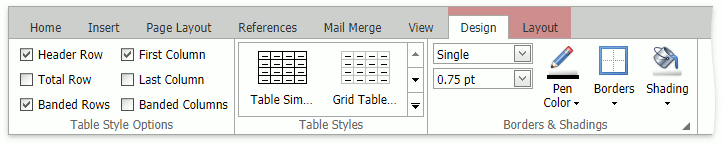
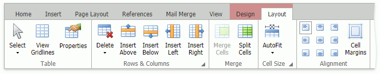
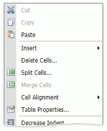

# Tables
You can create and edit tables in documents. 

Click the **Table** button in the **Insert** tab and select the table size in the drop-down box.

## Resize Table Element
Drag cell borders to change column widths or row heights. 

You can use [ruler](viewing-and-navigating/show-horizontal-ruler.md) markers to resize columns. 

## Context Tabs
Use buttons in the **Design** and **Layout** context tabs to customize a table's design and layout settings. These tabs appear when a pointer is in a table element.

## Context Menu
Right-click a table element to display a context menu. You can use the menu's commands to modify the table's properties and layout.

## Keyboard Navigation
You can use arrow keys or press TAB and TAB+SHIFT to navigate through cells. Press SHIFT with the arrow keys to select cells.

 

