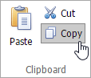
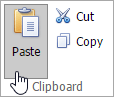

# Cut, Copy and Paste Editor's Content
The **Rich Text Editor** allows you to move and copy text and images using the clipboard.

> [!NOTE]
> Note that you can use clipboard only in IE. For other browsers, use the keyboard shortcuts Ctrl+C, Ctrl+X and Ctrl+V to copy, cut and paste respectively.

To move or copy a text or image, follow the steps below.
1. [Select the text or image](select-text.md) you wish to move or copy.
2. Do one of the following.
	* To move the selection, click the **Cut** button in the **Clipboard** group within the **Home** tab, or press CTRL+X. This cuts the selection from the document and places it on the clipboard.
		
		
	* To copy the selection, click the **Copy** button in the **Clipboard** group within the **Home** tab, or press CTRL+C. This copies the selection and places it on the clipboard.
		
		
3. Point to the position where you want to insert the contents from the Clipboard.
4. Click the **Paste** button in the **Clipboard** group within the **Home** tab, or press CTRL+V, or press SHIFT+INSERT. This pastes the contents of the clipboard into the document.
	
	