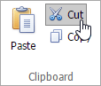

# Cut, Copy and Paste Editor's Content
The **Rich Text Editor** allows you to move and copy text and images using the Clipboard.

> Note that you can use Clipboard only in IE. For other browsers, use the keyboard shortcuts **Ctrl+C**, **Ctrl+X** and **Ctrl+V** to copy, cut and paste respectively.

To move or copy a text or image, follow the steps below.
1. [Select the text or image](../../../../interface-elements-for-web/articles/rich-text-editor/text-editing/select-text.md) you wish to move or copy.
2. Depending on what you want, do one of the following.
	* To move the selection, click the **Cut** button in the **Clipboard** group within the **Home** tab, or press **CTRL+X**. This cuts the selection from the document and places it on the Clipboard.
		
		
	* To copy the selection, click the **Copy** button in the **Clipboard** group within the **Home** tab, or press **CTRL+C**. This copies the selection and places it on the Clipboard.
		
		
3. Point to the position where you want to insert the contents from the Clipboard.
4. Click the **Paste** button in the **Clipboard** group within the **Home** tab, or press **CTRL+V**, or press **SHIFT+INSERT**. This pastes the contents of the Clipboard into the document.
	
	