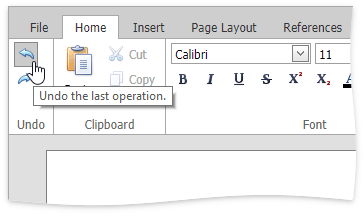
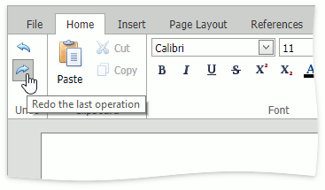

# Undo and Redo Last Operations
The **Rich Editor** allows you to undo and redo the last operation using special buttons (**Undo** and **Redo**) in the **Common** group in the **Home** tab.

The **Undo** command reverses the most recent action you have performed. To undo an action, click the **Undo** button in the **Common** group, or press CTRL+Z.

You can execute multiple Undo operations. To return the document to its previous state, just keep performing Undo.

The **Redo** command enables you to take back the last action you've undone. To redo an action, click the **Redo** button in the **Common** group, or press CTRL+Y.

