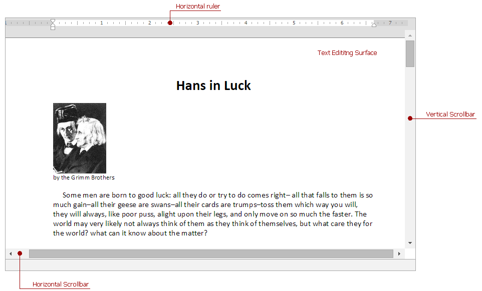
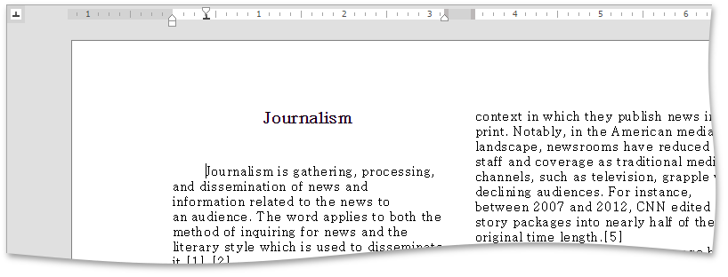
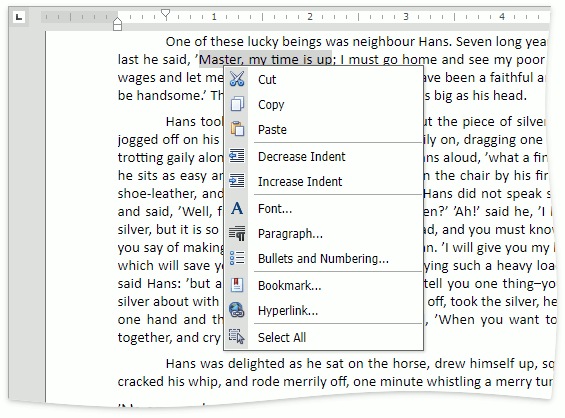

# Editor Elements
The **Rich Text Editor** consists of visual elements that provide you with the capability to edit and view documents.

## Main Elements
The main area of the **Rich Text Editor** control is the **Text Editing Surface** that displays a document to be edited. Here, a document looks as it will appear when you print it.

At the top of the **Text Editing Surface**, the **Rich Text Editor** displays a horizontal **ruler**, which you can use to align text, graphics, and other elements in a document. The horizontal **ruler** controls the width of table columns and the horizontal spacing of paragraph margins, columns and tabs. You can control the [ruler visibility](../viewing-and-navigating/show-horizontal-ruler.md).

At the bottom and at the right of the **Text Editing Surface** there are horizontal and vertical **scrollbars**, which allow you to navigate through a document.

## Context Menu
The **Rich Text Editor** supports the **Context Menu** that appears when you right-click on the **Text Editing Surface**.

