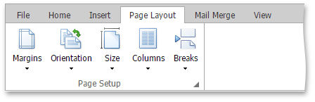
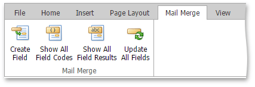
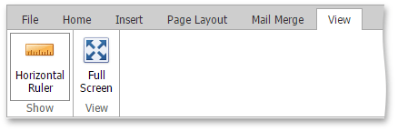

# Ribbon Interface
The comprehensive functionality for the **Rich Text** control can be provided via a set of **Ribbon** tabbed pages. **Ribbon** pages are divided into logical groups that include commands with common features.

## File

* [Create a New Document](../../../../interface-elements-for-web/articles/rich-text-editor/file-operations/create-a-new-document.md)
* [Load a Document](../../../../interface-elements-for-web/articles/rich-text-editor/file-operations/load-a-document.md)
* [Save a Document](../../../../interface-elements-for-web/articles/rich-text-editor/file-operations/save-a-document.md)
* [Print a Document](../../../../interface-elements-for-web/articles/rich-text-editor/file-operations/print-a-document.md)

## Home

* [Undo and Redo Last Operations](../../../../interface-elements-for-web/articles/rich-text-editor/text-editing/undo-and-redo-last-operations.md)
* [Cut, Copy and Paste Editor's Content](../../../../interface-elements-for-web/articles/rich-text-editor/text-editing/cut-copy-and-paste-editor's-content.md)
* [Format Text](../../../../interface-elements-for-web/articles/rich-text-editor/formatting/format-text.md)
* [Format Paragraphs](../../../../interface-elements-for-web/articles/rich-text-editor/formatting/format-paragraphs.md)
* [Using Indents](../../../../interface-elements-for-web/articles/rich-text-editor/formatting/using-indents.md)
* [Using Tabs](../../../../interface-elements-for-web/articles/rich-text-editor/formatting/using-tabs.md)
* [Apply Predefined Styles](../../../../interface-elements-for-web/articles/rich-text-editor/formatting/apply-predefined-styles.md)

## Insert

* [Insert a Page Break](../../../../interface-elements-for-web/articles/rich-text-editor/miscellaneous/insert-a-page-break.md)
* [Insert, Select, Copy or Delete a Picture or Text Box](../../../../interface-elements-for-web/articles/rich-text-editor/pictures-and-text-boxes/insert-select-copy-or-delete-a-picture-or-text-box.md)
* [Insert a Hyperlink](../../../../interface-elements-for-web/articles/rich-text-editor/miscellaneous/insert-a-hyperlink.md)
* [Insert a Symbol](../../../../interface-elements-for-web/articles/rich-text-editor/miscellaneous/insert-a-symbol.md)

## Page Layout

* [Adjust Page Settings](../../../../interface-elements-for-web/articles/rich-text-editor/document-layout-and-page-setup/adjust-page-settings.md)
* [Divide a Documents into Sections](../../../../interface-elements-for-web/articles/rich-text-editor/document-layout-and-page-setup/divide-a-documents-into-sections.md)
* [Lay Out Text in Columns](../../../../interface-elements-for-web/articles/rich-text-editor/document-layout-and-page-setup/lay-out-text-in-columns.md)
* [Insert a Page Break](../../../../interface-elements-for-web/articles/rich-text-editor/miscellaneous/insert-a-page-break.md)

## Mail Merge

* [Mail Merge](../../../../interface-elements-for-web/articles/rich-text-editor/mail-merge.md)

## View

* [Show Horizontal Ruler](../../../../interface-elements-for-web/articles/rich-text-editor/viewing-and-navigating/show-horizontal-ruler.md)
* [Full Screen Mode](../../../../interface-elements-for-web/articles/rich-text-editor/viewing-and-navigating/full-screen-mode.md)