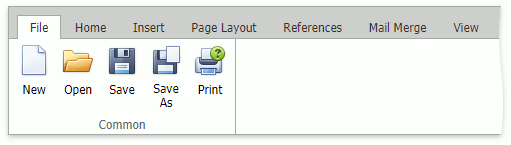
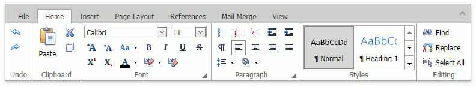

# Ribbon Interface
The comprehensive functionality for the **Rich Text** control can be provided via a set of **Ribbon** tabbed pages. **Ribbon** pages are divided into logical groups that include commands with common features.

## File

* [Create a New Document](../file-operations/create-a-new-document.md)
* [Load a Document](../file-operations/load-a-document.md)
* [Save a Document](../file-operations/save-a-document.md)
* [Print a Document](../file-operations/print-a-document.md)

## Home

* [Undo and Redo Last Operations](../text-editing/undo-and-redo-last-operations.md)
* [Cut, Copy and Paste Editor's Content](../text-editing/cut-copy-and-paste-editors-content.md)
* [Format Text](../formatting/format-text.md)
* [Format Paragraphs](../formatting/format-paragraphs.md)
* [Using Indents](../formatting/using-indents.md)
* [Using Tabs](../formatting/using-tabs.md)
* [Apply Predefined Styles](../formatting/apply-predefined-styles.md)

## Insert

* [Insert a Page Break](../miscellaneous/insert-a-page-break.md)
* [Insert, Select, Copy or Delete a Picture or Text Box](../pictures-and-text-boxes/insert-select-copy-or-delete-a-picture-or-text-box.md)
* [Insert a Hyperlink](../miscellaneous/insert-a-hyperlink.md)
* [Insert a Symbol](../miscellaneous/insert-a-symbol.md)

## Page Layout

* [Adjust Page Settings](../document-layout-and-page-setup/adjust-page-settings.md)
* [Divide a Documents into Sections](../document-layout-and-page-setup/divide-a-documents-into-sections.md)
* [Lay Out Text in Columns](../document-layout-and-page-setup/lay-out-text-in-columns.md)
* [Insert a Page Break](../miscellaneous/insert-a-page-break.md)

## Mail Merge

* [Mail Merge](../mail-merge.md)

## View

* [Show Horizontal Ruler](../viewing-and-navigating/show-horizontal-ruler.md)
* [Full Screen Mode](../viewing-and-navigating/full-screen-mode.md)