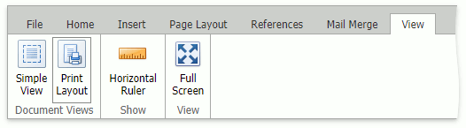

# Document Views
Use ribbon buttons in **View** tab's **Document Views** group to switch document views.

The **Simple View** displays a document in the entire editing area and ignores the page layout. In this mode, the editor does not split a document into pages and ignores headers, footers, and page layout settings: margins, orientation, size, columns, and breaks.

The **Print Layout** displays a document split into pages, with headers, footers, and with applied page layout settings: margins, orientation, size, columns, and breaks.
