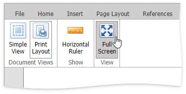

# Full Screen Mode
The **Rich Editor** provides functionality to display a document in full screen mode.

To turn on full screen mode, go to the **View** tab and click the **Full Screen** button in the **View** group.

To disable the full screen mode, click the same button.