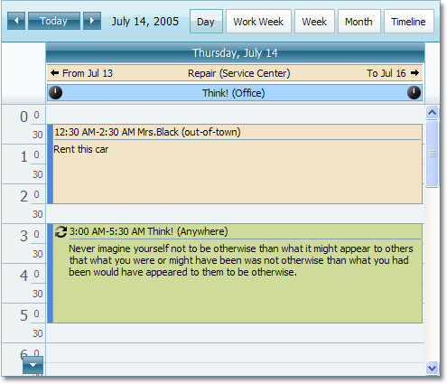

# Scheduler
This section describes the capabilities provided by the Scheduler, which is used for scheduling/calendar activities.

&nbsp;

**Appointment  Editing**
* [Create an Appointment](scheduler/appointment-management/create-an-appointment.md)
* [Edit an Appointment](scheduler/appointment-management/edit-an-appointment.md)
* [Manage Reminders](scheduler/appointment-management/manage-reminders.md)
* [Make a Series of Recurring Appointments](scheduler/appointment-management/make-a-series-of-recurring-appointments.md)
* [Delete an Appointment](scheduler/appointment-management/delete-an-appointment.md)
* [Restrictions for Operations with Appointments](scheduler/appointment-management/restrictions-for-operations-with-appointments.md)

&nbsp;

**Layout Customization**
* [Switch Scheduler Views](scheduler/layout-customization/switch-scheduler-views.md)
* [Scheduler Grouping](scheduler/layout-customization/scheduler-grouping.md)

&nbsp;

**Selection and Navigation**
* [Navigate Time Cells and Dates in the Scheduler](scheduler/selection-and-navigation/navigate-time-cells-and-dates-in-the-scheduler.md)
* [Navigate Scheduler Resources](scheduler/selection-and-navigation/navigate-scheduler-resources.md)
* [Scheduler Navigation Buttons](scheduler/selection-and-navigation/scheduler-navigation-buttons.md)
* [Scheduler 'More' Buttons](scheduler/selection-and-navigation/scheduler-more-buttons.md)