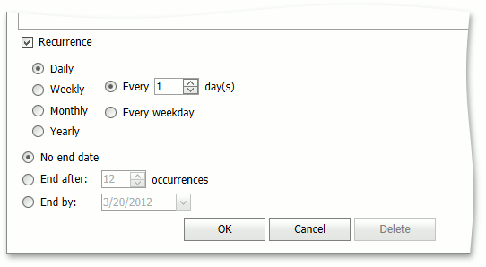

# Create an Appointment
To create a new appointment, click within the Scheduler time cell area to select cell(s). A smart tag will appear shortly:

Click it to invoke the default popup menu.

Menu items highlighted in the illustration, are intended for creating new appointments. By default, they are:
1. **New Appointment**
	
	 Invokes the **Edit Appointment** dialog shown below.
	
	The **Start time** and **End time** values are initially set to the beginning and ending boundaries of the current date and time selection. The **Show time as** field is set to **Busy**. The **Resource** field value is set to the resource to which the selected cell belongs, although it may be **Any**, when appointments are not grouped by resources.
	
	
	
	Fill in the **Subject**  and **Location** fields. If necessary, drop some lines of text into the text box at the bottom of the dialog, and they will be shown within an appointment in either **Day View** or **Work Week View**.
	
	You can switch the appointment's **Reminder** on, for future notifications.
2. **New All Day Event**
	
	Invokes the **Edit Event** window, which is used to create a new all-day appointment (also called an 'all-day event'). The window is the same as the **Edit Appointment**, except that, in this case, the **All day event** option is checked, its time range is measured in days (not hours) and marked as **Free**. The appointment can be transformed into the all-day event and vice-versa, by selecting this check box.
3. **New Recurring Appointment**
	
	 All appointments maintained by the Scheduler can either be simple (non-recurring), which happen only once, or [recurring](make-a-series-of-recurring-appointments.md), which occur multiple times with a predefined time interval.
	
	Selecting this menu item invokes the **Edit Appointment** dialog, used to create a new appointment, extended with the **Recurrence** feature, which allows the recurrence pattern to be specified for the new appointment.
	
	
4. **New Recurring Event**
	
	Selecting this menu item invokes the **Edit Event** window, used to create a new all-day appointment, extended with the **Recurrence** feature, which allows the recurrence pattern to be specified for the new event.
	
	For more information, see [Make a Series of Recurring Appointments](make-a-series-of-recurring-appointments.md).
