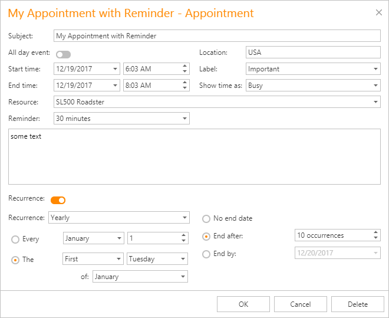

# Create an Appointment
To create a new appointment, click within the Scheduler's time cell area to select the cell(s). This makes a smart tag appear:

Click it to invoke the default popup menu:

The default menu items highlighted in the illustration are intended for creating new appointments.
1. **New Appointment**
	
	 Invokes the **Edit Appointment** dialog shown below.
	
	The **Start time** and **End time** values are initially set to the current date and time selection's start and end boundaries. The **Show time as** field is set to **Busy**. The **Resource** field value is set to the selected cell's resource. It can also be **Any** when appointments are not grouped by resources.
	
	
	
	Complete the **Subject**  and **Location** fields. If necessary, drop lines of text into the text box at the bottom of the dialog to display it within an appointment in **Day View** or **Work Week View**.
	
	You can switch the appointment's **Reminder** on to enable notifications.
2. **New All Day Event**
	
	Invokes the **Edit Event** window, which is used to create a new all-day appointment (also called an 'all-day event'). The window is the same as the **Edit Appointment**, except that, in this case, the **All day event** option is checked, its time range is measured in days (not hours) and it is marked as **Free**. The appointment can be transformed into the all-day event and vice-versa by selecting this check box.
3. **New Recurring Appointment**
	
	 All appointments the Scheduler maintains can either be simple (non-recurring) or [recurring](make-a-series-of-recurring-appointments.md) (occur multiple times with a predefined time interval).
	
	Selecting this menu item invokes the **Edit Appointment** dialog used to create a new appointment, extended with the **Recurrence** feature which allows specifying the recurrence pattern for the new appointment.
	
	
4. **New Recurring Event**
	
	Selecting this menu item invokes the **Edit Event** window used to create a new all-day appointment, extended with the **Recurrence** feature which allows specifying the recurrence pattern for the new event.
	
	See [Make a Series of Recurring Appointments](make-a-series-of-recurring-appointments.md) for more information.
