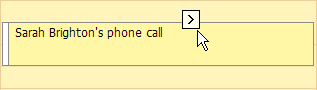
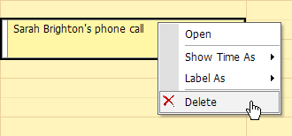
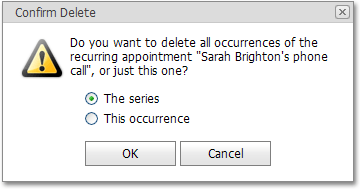

# Delete an Appointment
Use the popup (context) menu to delete an appointment.

First, click within the appointment to select it. Wait a moment. A smart tag will appear shortly:

Click it to invoke the default popup menu.

> [!NOTE]
> You can right-click within the appointment to invoke the editing menu, but this action may result in different menus if the browser (or the page) provides another context menu, overriding the scheduler action.

Click **Delete**.

If an appointment belongs to a recurrence chain, then a confirmation dialog appears.

You can choose whether all appointments in a series should be deleted, or only this particular appointment.