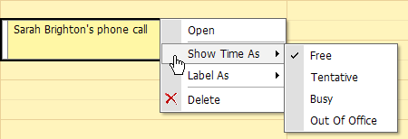
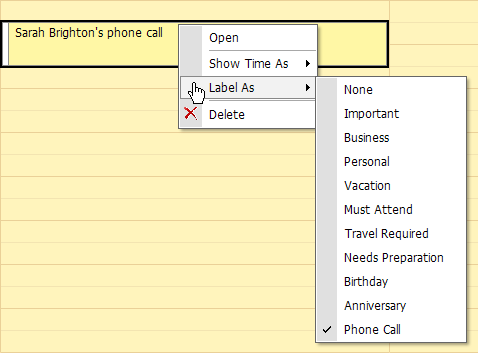
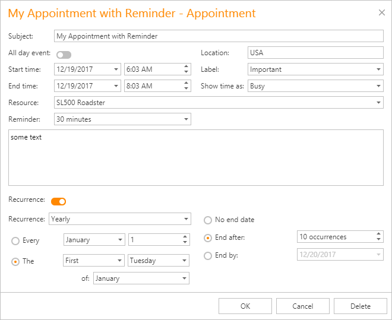
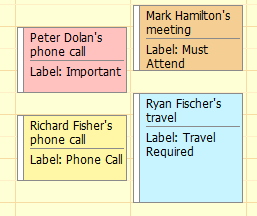
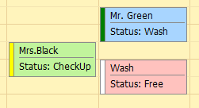
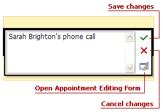
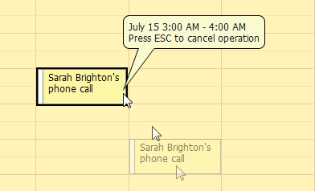

# Edit an Appointment
## <a name="contextmenu"/>Context Menu
There are two ways to invoke an appointment's context menu:
* **Right-click an appointment.**
* **Use a smart tag.** To invoke a smart tag, click on an appointment and wait for the smart tag to appear. Then, click on the smart tag to invoke the context menu.
	
	> [!NOTE]
	> This approach may be useful if you use a web browser (for example, **Opera**) and right-clicking on an appointment does not invoke a **Scheduler** control's context menu.

This context menu contains items that allow you to modify certain appointment properties. For example, you can use the **Show Time As** submenu to change an appointment's status.

If you select the **Label As** menu item, you can choose another label for the current appointment from the list of available label types.

This menu also contains the **Open** item which allows you to invoke the appointment's [Edit Appointment dialog](#editappointmentdialog).

> [!NOTE]
> The appointment's context menu can also contain the **Edit Series** and **Restore Default State** menu items. This means that an appointment is a part of a recurring appointment series. See [Make a Series of Recurring Appointments](make-a-series-of-recurring-appointments.md) for more information.

## <a name="editappointmentdialog"/>Edit Appointment Dialog
To invoke the **Edit Appointment** dialog, select **Open** in an appointment's [context menu](#contextmenu). This dialog's usual appearance is illustrated below.

The **Edit Appointment** dialog allows you to edit the following appointment properties:
* **Subject**
	
	An appointment's subject. This text is displayed within an appointment to identify it.
* **Location**
	
	Information about where an appointment takes place. This text is displayed within the appointment in parentheses after the subject text.
* **Label**
	
	Used for at-a-glance appointment identification. It is displayed in the **Scheduler** as a background color of the rectangle that represents the appointment.
	
	
* **Start time** and **End time**
	
	An appointment's start/end date and time.
* **Show time as**
	
	Indicates an appointment's availability status. It is displayed as a strip on the appointment rectangle's left side. The strip is colored according to the status type.
	
	
* **All day event**
	
	Transforms an appointment into an all-day event which always lasts an entire day (or several days). Note that if this property is **true**, the **Start** and **End** properties' real-time values are ignored, and instead, the appointment starts at **0:00** on the **Start** date and ends at **24:00** on the **End** date.
* **Resource**
	
	A resource that is assigned to an appointment. This resource can be used to [group appointments by resources](../layout-customization/scheduler-grouping.md).
* **Reminder**
	
	Allows you to set a reminder that is responsible for sending notifications at a specified period before an appointment's start time. Refer to [Manage Reminders](manage-reminders.md) for more details.
* **Description**
	
	The text box located below the **Resource** and **Reminder** options. This text box allows you to enter a description that is shown within an appointment in **Day View** or **Work Week View**.
* **Recurrence**
	
	Expands the **Recurrence** section that specifies the appointment's recurrence pattern. See [Make a Series of Recurring Appointments](make-a-series-of-recurring-appointments.md) for more information.

## In-place Editor
Double-click an appointment to invoke its **In-place Editor** which allows you to edit an appointment's **Subject**.

Note that if you need to edit other appointment properties, you can invoke the [Edit Appointment dialog](#editappointmentdialog) via the **Open Appointment Editing Form** button.

## Mouse Operations
To select an appointment, click it with the left mouse button. To select several appointments, press and hold the Ctrl key and then click appointments with the left mouse button.

Drag-and-drop operations enable you to change an appointment's time interval if an appointment is moved along a time cell area.

If you press Esc before dropping an appointment, all changes are canceled, and the appointment returns to its original location.

If you press and hold the Ctrl key and click and drag an appointment (or several appointments), you create appointment copy(s) when the mouse button is released.

You can also change an appointment's type to **all-day** and vice-versa by dragging the appointment between the all-day area and time cells.

In [grouped](../layout-customization/scheduler-grouping.md) views, when different columns represent different resources, dragging the appointment to another column automatically changes the associated resource.
