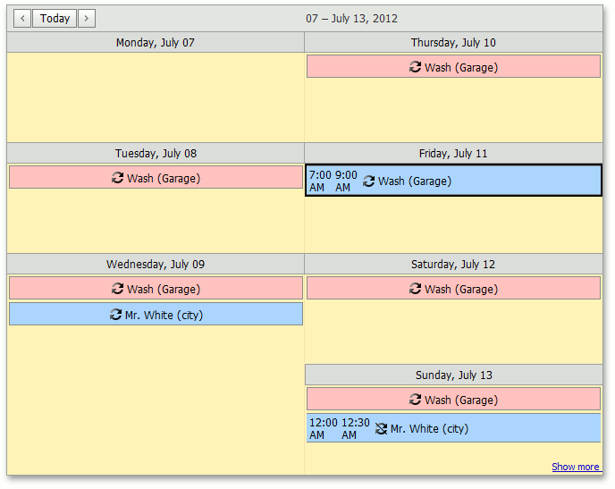
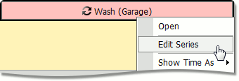
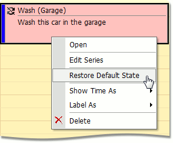

# Make a Series of Recurring Appointments
## What is a Recurring Appointment?
The **Scheduler** control supports simple (non-recurring) or recurring appointments. Non-recurring appointments occur only once at a specified time interval. Recurring appointments occur many times at the same time interval on different dates.

Recurring appointments are created as a series of appointments using the [recurrence pattern](#recurrencepattern) and identified by the  recurrence sign.

## <a name="recurrencepattern"/>Recurrence Pattern
The recurrence pattern contains information on appointment recurrence (the recurrence series's start date and time and a rule according to which a series is repeated).

You can create and edit an appointment's recurrence pattern in the standard [Edit Appointment](edit-an-appointment.md) dialog by selecting the **Recurrence** check box. The image below illustrates the usual appearance of the **Edit Appointment** dialog's recurrence section.

In this dialog, you can specify different elements' values to define the recurrence behavior. Frequency is the recurrence pattern's base element. It specifies how often the corresponding appointments occur: **Daily**, **Weekly**, **Monthly** or **Yearly**.

You can define periodicity for each frequency type - the time interval in which the recurrence's frequency is applied. For instance, if you have specified that appointments occur **Daily**, you can also specify whether appointments repeat every couple of days or every weekday. For the **Monthly** appointment frequency, you can specify for how many weeks and on which weekdays an appointment recurs.

You can also specify when an appointment's recurrence must end.

If an appointment is recurring, its context menu contains the **Edit Series** item. Clicking this item invokes the **Edit Appointment** dialog for editing the recurrence pattern.

If you use the context menu's **Open** item to invoke the **Edit Appointment** dialog, you can edit only the current appointment to avoid raising [exceptions](#exceptions).

## <a name="exceptions"/>Exceptions
When you modify an occurrence's (an appointment that belongs to a recurring appointment series) properties, it is called an **Exception**. Such appointments are marked with the  crossed recurrence sign.

You can delete one or several  occurrences in the recurrence chain. A deleted occurrence is a type of recurrence pattern Exception, and the SchedulerControl does not visualize it.

To replace an exception with a regular occurrence and discard all modifications, right-click the exception and click on the **Restore Default State** item in the invoked context menu.

Editing an appointment series's recurrence pattern (**Edit Series** context menu item) resets the recurrence chain, and restores all the exceptions to their default state. A warning is displayed before this happens.
