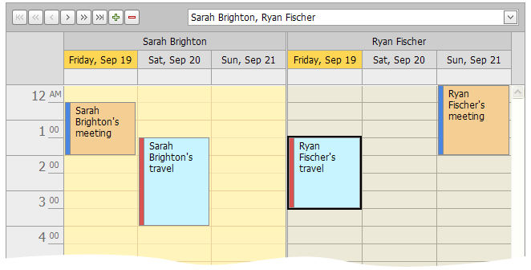
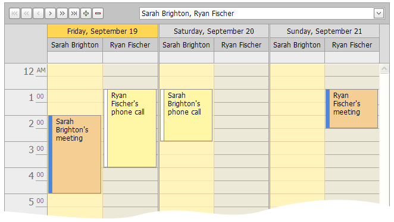

# Scheduler Grouping
The data can be grouped either by resources or by dates, to enhance the visual representation. The following pictures illustrate the appearance of the control in grouping mode.

## Appointments Grouped by Resources

## Appointments Grouped by Date
